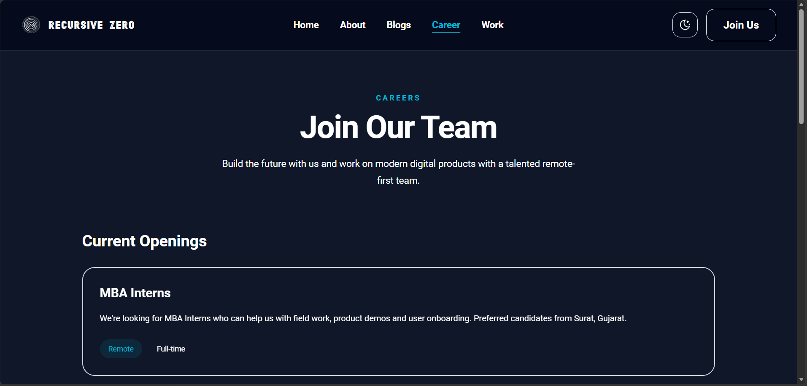
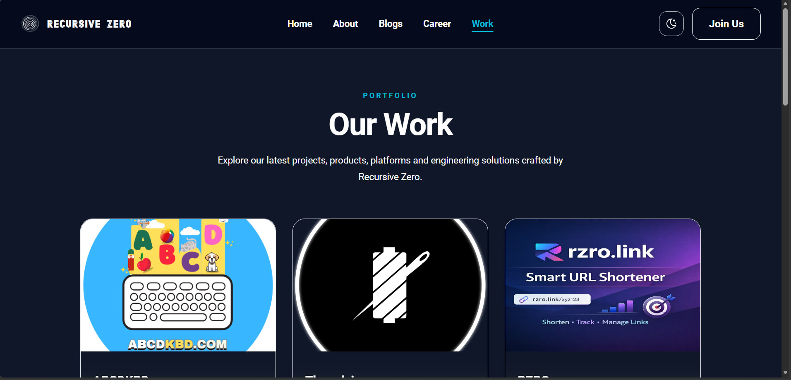

# RecursiveZero Private Limited

Welcome to the official website repository of **RecursiveZero Private Limited**.

This project powers **recursivezero.com** and showcases our products, services, engineering capabilities, technical blogs, and company information.

## About RecursiveZero

RecursiveZero is a technology-driven company focused on building scalable digital products, modern web applications, AI-powered solutions, and innovative software platforms.

## Features

- Modern Astro-based website
- Responsive design for mobile, tablet, and desktop
- Dark & Light theme support
- Technical blogs and articles
- Portfolio and project showcase
- Privacy Policy and Terms & Conditions pages
- Performance-optimized architecture

## Tech Stack

- Astro
- TypeScript
- Tailwind CSS
- Markdown Content Collections

## Getting Started

### Install Dependencies

```bash
npm install
```

### Run Development Server

```bash
npm run dev
```

### Build for Production

```bash
npm run build
```

### Preview Production Build

```bash
npm run preview
```

## Screenshots

## Dark Mode






## LightMode


## Contact

📧 [recursivezero@outlook.com](mailto:recursivezero@outlook.com)

🌐 https://recursivezero.com

## License

Copyright © RecursiveZero Private Limited. All rights reserved.
